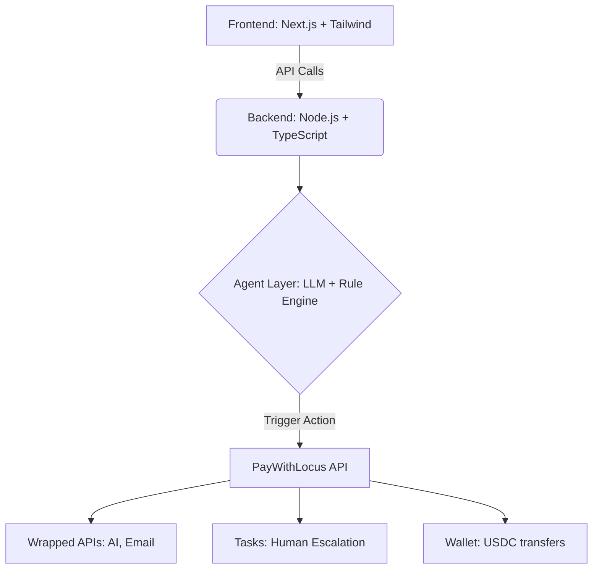

<div align="center">
  <h1>💸 Subscription Saver Agent</h1>
  <p><strong>Your AI agent that fights subscriptions and wins your money back.</strong></p>
  <p>
    Built for <strong>Paygentic Week 1 (PayWithLocus)</strong> — where agents don’t just analyze finances… they <strong>act on them</strong>.
  </p>
  <p>
    
    
    
    
  </p>
</div>

<br />

An autonomous AI agent that **detects overcharges, negotiates bills, and recovers money for you** — while you sleep.

## 🚀 Problem

People lose money every month due to:

- 📉 **Forgotten subscriptions**
- 🤫 **Silent price hikes**
- 🕰️ **Missed downgrade & refund opportunities**
- ⏳ **Lack of time to negotiate bills**

Most finance apps only *track spendings* — they don’t **recover money**.

---

## 💡 Solution

**Subscription Saver Agent** automatically:

1. **Ingests bills** (CSV, PDF, or manual input)
2. **Detects** recurring charges and flags sudden overcharges
3. **Generates** cancellation and refund emails automatically
4. **Escalates** complex cases to human taskers via Locus Tasks
5. **Sends** recovered money back to the user via USDC

**Result:** Real, measurable, and automated savings!

---

## ⚡ Key Features

✨ **Smart Detection Engine**  
> Identifies recurring subscriptions, categorizes expenses, and flags price increases or billing anomalies.

🤖 **Auto Negotiation**  
> Instantly generates perfectly crafted refund/cancellation emails using LLMs, maximizing the chances of getting your money back.

🧑‍🤝‍🧑 **Human-in-the-loop Tasks**  
> Seamlessly escalates complex disputes using Locus Tasks for cases where AI needs a human touch.

💸 **Automated Payouts**  
> Sends successfully recovered funds instantly via USDC (to a wallet or via email transfer).

📊 **Live Dashboard**  
> Track money recovered, monthly savings, agent operational spend, and your net profit in real-time.

---

## 🧩 Built with PayWithLocus

This project leverages key PayWithLocus primitives to close the loop from AI insight to financial action:

- **Unified USDC Wallet**: Programmatic control over balances.
- **Wrapped APIs**: Orchestrating AI models, web scraping, and emails.
- **Task Marketplace**: Human-in-the-loop escalation for complex negotiations.
- **Spending Controls & Audit Logs**: Ensuring agents operate safely within budgets.
- **USDC Transfers**: Moving recovered funds via wallets or email.

---

## 🏗️ Architecture



## 🔄 How It Works


---

## 📸 Demo Flow

1. **Upload** a sample credit card bill or CSV.
2. **Detect** - the Agent flags a hidden 30% price increase from a SaaS product.
3. **Draft** - generates a firm refund email requesting a credit for the unnotified charge.
4. **Escalate** - escalates a tricky uncooperative vendor case to a human task (optional).
5. **Recover** - shows standard and recovered money in the live dashboard.
6. **Payout** - sends a payout of the recovered amount via Locus USDC.

---

## ⚙️ Setup & Run

### 1. Clone the repository
```bash
git clone https://github.com/YowaiMo-Koustav/PayFi.git
cd PayFi
```

### 2. Install dependencies
```bash
npm install
# or
yarn install
```

### 3. Setup environment variables
Create a `.env` file in the root directory:
```env
LOCUS_API_KEY=your_api_key_here
NEXT_PUBLIC_APP_NAME=SubscriptionSaver
```

### 4. Run the development server
```bash
npm run dev
# or
yarn dev
```
Open [http://localhost:3000](http://localhost:3000) with your browser to see the result.

---

## 🧪 MVP Scope (Hackathon)

- [x] CSV upload processing
- [x] Recurring charge detection logic
- [x] AI-generated email drafts
- [x] One complete Locus API integration
- [x] One automated payout flow
- [x] Mocked/Full bank integration testing
- [x] Production-grade UI & security

---

## 🏆 Why This Can Win

* **Directly makes users money:** The ROI is obvious and immediate.
* **Deep integration:** Utilizes multiple unique Locus primitives.
* **Demo-friendly:** A clear visual workflow that audiences instantly relate to.
* **Fully functional:** Demonstrates a real loop, not just a pitch.

---

## 📈 Future Improvements

* **Direct Bank API integration:** (Plaid/Teller) to automatically sync transactions.
* **Auto email sending & tracking:** Direct integration with Gmail/Outlook API.
* **Subscription cancellation automation:** Headless browser automation mapping.
* **Multi-currency support:** Real-time FX tracking with USDC base.
* **Personal finance insights:** Predictive budgeting and forecasting.

---

## ❤️ Acknowledgements

* **PayWithLocus Team:** For providing flexible, action-oriented financial APIs.
* **Paygentic Hackathon:** For hosting an incredible environment for agentic protocols.

